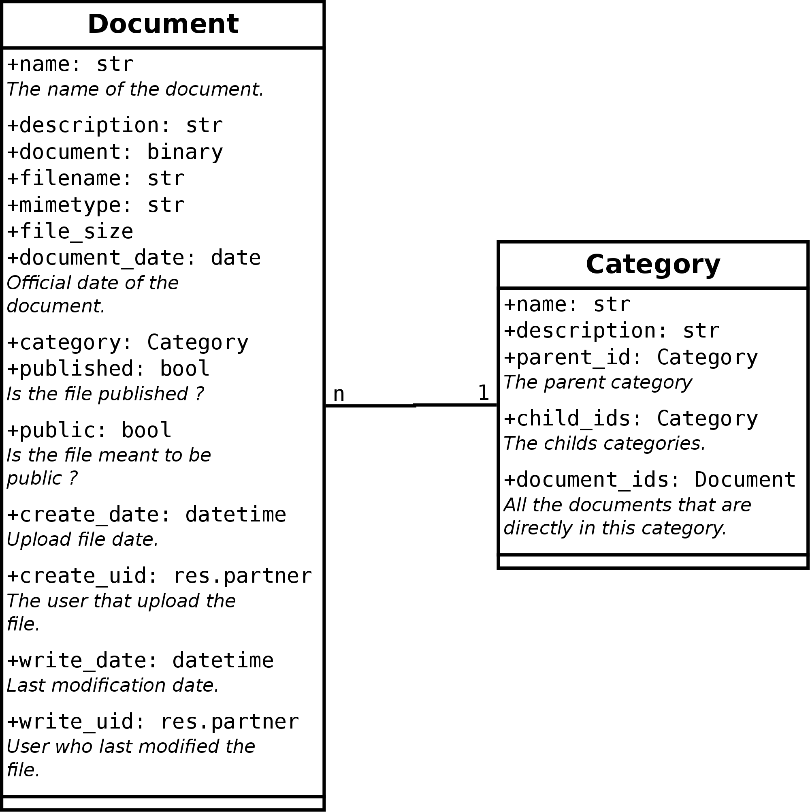

# CoopDocument : la gestion des documents {#sec:coopdocument}

Ce chapitre traite de l'application permettant de gérer les documents
importants de la coopérative, afin de les stocker et de les mettre à
disposition des coopérateurs ou du tout public.

## Le besoin

La BEES coop est une coopérative à finalité sociale qui suis les
principes coopératifs \cite{site:identite-cooperative}, notamment celui
du « contrôle démocratique exercé par les
membres ». \cite{site:fonctionnement-beescoop}
Afin que le contrôle démocratique puisse être exercé par les
coopérateurs, la coopérative souhaite mettre à disposition des documents
aux coopérateurs. Quelques exemples de documents sont :

- les procès verbaux de l'assemblée générale et des autres comités et
  instances ;
- les documents de préparation aux assemblées générales ;
- les statuts ;
- le règlement d'ordre intérieur ;
- etc.

Certain documents sont à destination de tous le monde, d'autre sont à
destination exclusive des coopérateurs. Les statuts, par exemple,
peuvent être exposé à tout public, cela permet aux personnes qui ne sont
pas encore coopérateurs d'en prendre connaissance, car leur approbation
est une obligation pour devenir coopérateur.  Les procès verbaux, quant
à eux, sont réservés aux coopérateurs, car ils peuvent potentiellement
contenir des informations que la coopérative ne souhaite pas partager
avec le tout public.

Afin que les coopérateurs puissent retrouver facilement les documents
qu'ils cherchent, la BEES coop souhaite que ces documents puissent être
rangé dans des catégories. Ces catégories doivent pouvoir être choisie
par les administrateurs de la BEES coop et doivent pouvoir changer
facilement.

CoopDocument doit donc fournir une interface administrateur qui permet
de :

- définir des catégories dans lesquelles ranger les documents ;
- téléverser tout type de document et les ranger dans les catégories ;
- définir quels documents sont publiés et lesquels ne le sont pas ;
- définir quels documents sont accessibles à tout public et lesquels sont
  réservés aux coopérateurs ;

CoopDocument doit aussi fournir une interface « website » via laquelle
les coopérateurs pourront accéder aux documents qui sont mis à leur
disposition.

## Conception

CoopDocument est la combinaison de deux modules :
*easy_my_coop_document* qui fournit l'interface d'administration et
*easy_my_coop_website_document* qui fournit l'interface *website*. Deux
modules différents permet de soit installer uniquement l'interface
administration, soit installer les deux interfaces car l'interface
*website* a besoin de l'interface administration pour fonctionner comme
montré dans la figure \vref{fig:intranet_package}. Il y a un intérêt à
utiliser uniquement l'interface d'administration si la coopérative
souhaite uniquement un endroit pour ranger des documents qui doivent
être accessible à ses employés, mais qui ne doivent pas être accessible
au tout public ni à des personnes ayant uniquement accès à l'interface
*website*.

### Easy My Coop Document : l'interface d'administration

La figure \vref{fig:document_class_dia} montre la structure du module.
Les catégories sont organisées sous forme hiérarchique, chaque catégorie
possède une catégorie parente *(parent_id)*, sauf si cette dernière les
catégories racines qui sont au sommet de la hiérarchie. L'ORM d'Odoo
fournit aussi automatiquement la relation inverse à partir d'une
catégorie, c'est-à-dire que les catégories enfants *(child_ids)* sont
accessibles. Attention que la recherche des catégories enfants n'est pas
récursive. Seul les enfants de la catégorie sont contenus dans
*(child_ids)* et non les enfants des enfants. Chaque document est rangée
dans une seule catégorie ou dans aucune catégorie.

Des informations non demandées explicitement ont été ajoutées lors de la
conception, car nécessaire au bon fonctionnement de l'application ou
jugées utiles. C'est le cas des champs *filename* et *mimetype* qui
contiennent, respectivement, le nom original du fichier et le type de
fichier (PDF, image, text, etc.). Ces deux champs ont été ajoutés afin de
pouvoir stocker tous type de document et pas uniquement des documents
PDF et afin de ne pas perdre d'information sur le document lorsque ce
dernier sera téléchargé par la suite. Il y a aussi les champs
*description* et *document_date* qui contiennent, respectivement, une
description du document et la date officiel du document. La description
est utile afin de donner l'utilisateur un aperçu de ce que contient le
document avant de le télécharger. Tandis que la date officielle du
document permet de trier et retrouver des documents sur base d'une date
utile. Par exemple, le PV de l'assemblée générale du 5 mai 2018, mais
qui sera téléversé seulement deux semaines plus tard pourra avoir comme
date officielle le 5 mai 2018 et non la date de téléversement sur
l'application qui n'as pas beaucoup de sens pour l'utilisateur.

{#fig:document_class_dia
width=100%}

La création d'interface d'administration dans Odoo se fait via des
fichiers XML. Chaque classe (*Document* et *Category*) peut se
visualiser de différentes manières. La première est la manière
formulaire *(form)* qui permet d'afficher les informations d'un seul
objet (un document ou une classe précise) sur une seule page et qui
permet aussi de modifier cet objet. La seconde est la manière sous forme
de liste *(tree)* qui permet d'afficher tous les objets dans une liste.
Cette liste peut alors être filtrée et il est possible de rechercher un
objet selon certains critères. Chaque manière est définie par une vue
*(view)* dans laquelle il faut indiquer quels champs doivent apparaitre,
comment et où. Ces vues sont définies dans des fichiers XML qui sont par
la suite convertis en entrées dans la base de donnée. Enfin, il ne faut
pas oublier d'ajouter des entrées dans les différents menus de
l'interface d'administration afin de pouvoir accéder à ces vues. L'ajout
des menus fonctionne d'une manière similaire à celle des vues.
C'est-à-dire que chaque entrée est décrite dans un fichier XML qui est
lu par Odoo et ajouté par la suite dans la base de donnée.

### Easy My Coop Website Document : l'interface *website*

La partie interface *website* fonctionne selon l'architecture MVC
(modèle-vue-contrôleur). Afin de pouvoir correctement les catégories et
les documents la vue doit les recevoir dans un format adéquat. En effet,
la vue doit se contenter d'afficher les informations et de les mettre en
page. Quant au tri et à l'arrangement des données c'est au contrôleur de
le faire. De plus le langage disponible dans la vue est plus restreint
que celui du contrôleur. C'est pourquoi le contrôleur ne peut pas se
contenter de donner la liste des documents et la liste des catégories à
la vue. Il doit les préparer de manière à ce que chaque document soit
lié à la catégorie à laquelle il appartient, et que les catégories
soient arrangées sous forme hiérarchique. La
figure \vref{fig:document_tree} donne un exemple de la structure choisie
pour transmettre les données, du contrôleur à la vue. Chaque nœud est
un tuple qui se compose de trois éléments :

1. la catégorie ;
2. une liste de nœuds, un pour chaque sous-catégorie ;
3. une liste des documents appartenant à la catégorie.

Le nœud racine ne contient pas de catégorie, le premier élément du tuple
est fixé à *None*. Il contient aussi la liste des documents qui
n'appartiennent à aucune catégorie. Cette structure est traitée de
manière récursive par la vue, afin de s'arrêter sur chaque nœud. À
chaque nœud, la vue peut afficher les informations liées à la catégorie
et peut aussi afficher les documents qu'elle contient. Ensuite, elle
parcourt la liste des sous-catégories et appelle de nouveau la vue pour
chaque élément de la liste.

{#fig:document_tree width=100%}

Le contrôleur doit aussi fournir une page qui permet de télécharger les
documents. Pour ce faire la réponse HTTP doit être structurée d'une
manière bien précise. Le *header* de cette réponse doit contenir le
fichier, mais aussi le *mime-type* du fichier, ainsi que sa taille. Les
fichiers binaires stockés dans Odoo sont encodés suivant l'algorithme
*base64* \cite{site:base64} qui permet de transformer un fichier binaire
en caractère ASCII. Il faut donc bien penser à décoder le fichier
binaire stocké dans Odoo avant de l'envoyer à l'utilisateur.

> Parler des fonctionnalités supplémentaires que je juge nécessaire:
> filtrer les documents par plage de dates, donner des descriptions aux
> documents et fournir une date de valeur au document. Pas vraiment
> nécessaire…

## Réalisation

> **TODO** : Prendre des captures d'écran et montrer que la réalisation
> rencontre bien le besoin.

## Améliorations

La solution proposée fonctionne et répond bien au besoin exprimé.
Cependant une petite amélioration viendrait rendre l'utilisation de
CoopDocument plus facile au jour le jour. Cette amélioration est la
possibilité de fixer des paramètres, à la catégorie, qui seront alors
appliqués à tous les documents qu'elle contient. Par exemple, il serait
intéressant de pouvoir définir si une catégorie est destinée à être
visible par tous ou pas. De cette manière les documents qu'elle contient
pourrait être automatiquement marqué comme disponible à tous. Cela
simplifie la gestion lorsqu'il y a beaucoup de documents.
